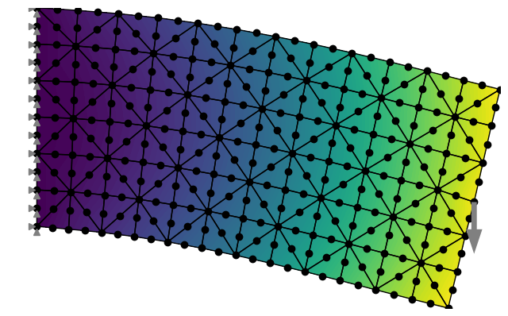
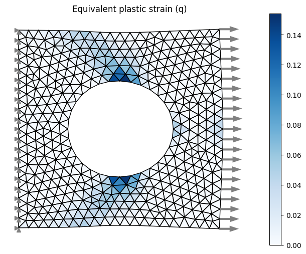
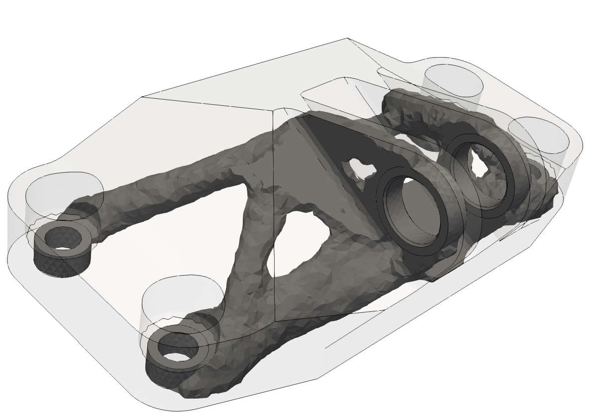
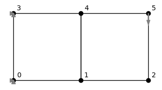
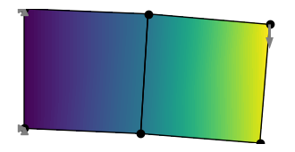

[](https://opensource.org/licenses/MIT)

[](https://pypi.org/project/torch-fem/)
[](https://github.com/psf/black)
[](https://mybinder.org/v2/gh/meyer-nils/torch-fem/HEAD)


# torch-fem: differentiable finite elements in PyTorch

Simple GPU accelerated finite element assemblers for small-deformation mechanics with PyTorch. 
The advantage of using PyTorch is the ability to efficiently compute sensitivities and use them in optimization tasks.

## Installation
Your may install torch-fem via pip with
```
pip install torch-fem
```

*Optional*: For GPU support, install CUDA and the corresponding CuPy version with
```
pip install cupy-cuda11x # v11.2 - 11.8
pip install cupy-cuda12x # v12.x
```

## Features 
- Elements
  - 1D: Bar1 (linear), Bar2 (quadratic) 
  - 2D: Quad1 (linear), Quad2 (quadratic), Tria1 (linear), Tria2 (quadratic)
  - 3D: Hexa1 (linear), Hexa2 (quadratic), Tetra1 (linear), Tetra2 (quadratic)
  - Shell: Flat-facet triangle (linear)
- Material models
  - Isotropic linear elasticity (3D, 2D plane stress, 2D plane strain, 1D)
  - Orthotropic linear elasticity (3D, 2D plane stress, 2D plane strain)
  - Isotropic plasticity (3D, 2D plane stress, 2D plane strain, 1D)
- Utilities
  - Homogenization of orthotropic stiffness (mean field)
  - I/O to and from other mesh formats via meshio

## Basic examples
The subdirectory `examples->basic` contains a couple of Jupyter Notebooks demonstrating the use of torch-fem for trusses, planar problems, shells and solids. 

</br>
**Simple cantilever beam:** There are examples with linear and quadratic triangles and quads.

</br>
**Plasticity in a plate with hole:** Isotropic linear hardening model for plane-stress.

## Optimization examples
The subdirectory `examples->optimization` demonstrates the use of torch-fem for optimization of structures (e.g. topology optimization, composite orientation optimization).

</br>
**Simple shape optimization of a truss:** The top nodes are moved and MMA + autograd is used to minimize the compliance.

</br>
**Simple topology optimization of a MBB beam:** You can switch between analytical sensitivities and autograd sensitivities.

</br>
**3D topology optimization of a jet engine bracket:** The model is exported to Paraview for visualization.

</br>
**Simple shape optimization of a fillet:** The shape is morphed with shape basis vectors and MMA + autograd is used to minimize the maximum stress.

</br>
**Simple fiber orientation optimization of a plate with a hole:** Compliance is minimized by optimizing the fiber orientation of an anisotropic material using automatic differentiation w.r.t. element-wise fiber angles.


## Minimal code
This is a minimal example of how to use torch-fem to solve a simple cantilever problem. 

```python
from torchfem import Planar
from torchfem.materials import IsotropicPlaneStress

# Material
material = IsotropicElasticityPlaneStress(E=1000.0, nu=0.3)

# Nodes and elements
nodes = torch.tensor([[0., 0.], [1., 0.], [2., 0.], [0., 1.], [1., 1.], [2., 1.]])
elements = torch.tensor([[0, 1, 4, 3], [1, 2, 5, 4]])

# Create model
cantilever = Planar(nodes, elements, material)

# Load at tip
cantilever.forces[5, 1] = -1.0

# Constrained displacement at left end
cantilever.constraints[[0, 3], :] = True

# Show model
cantilever.plot(node_markers="o", node_labels=True)
```
This creates a minimal planar FEM model:



```python
# Solve
u, f, σ, ε, α = cantilever.solve()

# Plot
cantilever.plot(u, node_property=torch.norm(u, dim=1))
```
This solves the model and plots the result:



If we want to compute gradients through the FEM model, we simply need to define the variables that require gradients. Automatic differentiation is performed through the entire FE solver.
```python 
# Enable automatic differentiation
cantilever.thickness.requires_grad = True
u, f = cantilever.solve()

# Compute sensitivity
compliance = torch.inner(f.ravel(), u.ravel())
torch.autograd.grad(compliance, cantilever.thickness)[0]
```

## Benchmarks 
The following benchmarks were performed on a cube subjected to a one-dimensional extension. The cube is discretized with N x N x N linear hexahedral elements, has a side length of 1.0 and is made of a material with Young's modulus of 1000.0 and Poisson's ratio of 0.3. The cube is fixed at one end and a displacement of 0.1 is applied at the other end. The benchmark measures the forward time to assemble the stiffness matrix and the time to solve the linear system. In addition, it measures the backward time to compute the sensitivities of the sum of displacements with respect to forces.

#### Apple M1 Pro (10 cores, 16 GB RAM)
Python 3.10, SciPy 1.14.1, Apple Accelerate

|  N  |     DOFs |  FWD Time |  BWD Time |   Peak RAM |
| --- | -------- | --------- | --------- | ---------- |
|  10 |     3000 |     0.24s |     0.15s |    567.7MB |
|  20 |    24000 |     0.74s |     0.25s |    965.7MB |
|  30 |    81000 |     2.63s |     1.18s |   1797.9MB |
|  40 |   192000 |     7.18s |     3.66s |   2814.2MB |
|  50 |   375000 |    15.60s |     9.12s |   3784.7MB |
|  60 |   648000 |    32.22s |    19.24s |   4368.8MB |
|  70 |  1029000 |    55.33s |    34.54s |   5903.4MB |
|  80 |  1536000 |    87.58s |    56.95s |   7321.9MB |
|  90 |  2187000 |   137.29s |   106.87s |   8855.2MB |


#### AMD Ryzen Threadripper PRO 5995WX (64 Cores, 512 GB RAM) 
Python 3.12, SciPy 1.14.1, scipy-openblas 0.3.27.dev

|  N  |     DOFs |  FWD Time |  BWD Time |   Peak RAM |
| --- | -------- | --------- | --------- | ---------- |
|  10 |     3000 |     0.12s |     0.06s |    618.5MB |
|  20 |    24000 |     0.54s |     0.34s |    934.7MB |
|  30 |    81000 |     1.90s |     1.33s |   1949.0MB |
|  40 |   192000 |     4.84s |     4.00s |   4061.1MB |
|  50 |   375000 |    10.43s |     9.58s |   6877.9MB |
|  60 |   648000 |    19.05s |    21.73s |  11318.2MB |
|  70 |  1029000 |    34.34s |    40.30s |  16345.3MB |
|  80 |  1536000 |    55.64s |    56.67s |  23191.6MB |
|  90 |  2187000 |    82.74s |   136.69s |  32951.2MB |

#### AMD Ryzen Threadripper PRO 5995WX (64 Cores, 512 GB RAM) and NVIDIA GeForce RTX 4090
Python 3.12, CuPy 13.3.0, CUDA 11.8

|  N  |     DOFs |  FWD Time |  BWD Time |   Peak RAM |
| --- | -------- | --------- | --------- | ---------- |
|  10 |     3000 |     0.55s |     0.11s |   1286.6MB |
|  20 |    24000 |     0.59s |     0.17s |   1286.8MB |
|  30 |    81000 |     0.68s |     0.26s |   1287.4MB |
|  40 |   192000 |     1.34s |     0.83s |   1314.3MB |
|  50 |   375000 |     1.68s |     1.10s |   1310.0MB |
|  60 |   648000 |     2.31s |     1.49s |   1303.9MB |
|  70 |  1029000 |     3.16s |     2.24s |   1303.9MB |


