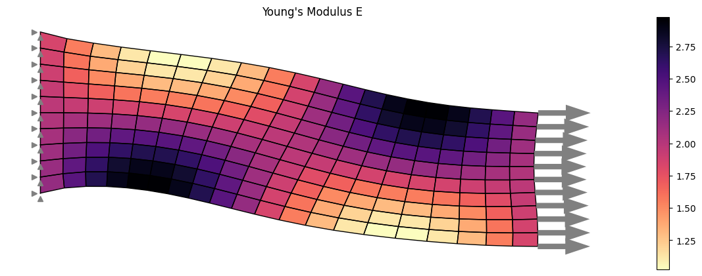
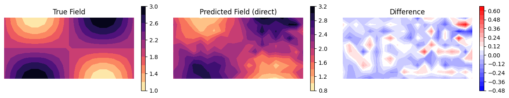
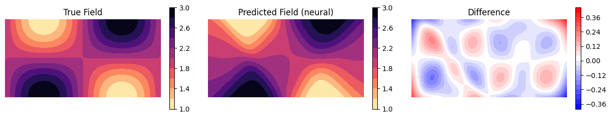

# Differentiability

*torch-fem* is called *torch-fem*, because it is built on top of *PyTorch* - one of the most popular frameworks for machine learning applications.

This allows us to compute gradients easily and let them flow seamlessly through the FEM Solver - think of torch-fem as just another layer in your ML pipeline. This opens many opportunities: 

- Combine Neural Networks and numerical solvers to train them together.
- Solving optimization tasks such as topology optimization, optimization of fiber orientations, or parameter identification.
- Formulate Hyperelastic materials by simply specifying the strain energy density function.

## Neural field example

Let's assume we have a graded property field, where the Youngs modulus is prescribed as a function $E : \mathbb{R}^2 \rightarrow \mathbb{R}$ on the domain $\Omega \in [0, 2] \times [0, 1]$. 

The function is given by 
$$
    E(x) = 2 + \sin(\pi x_0) \cos(\pi x_1)
$$

We solve the FEM problem with this exact field to get a synthetic ground truth of the deformation $u_\textrm{ref}$: 

### Direct solution of the inverse problem 

Let's solve the inverse problem now, i.e, we want to estimate the property field leading to the observed deformation field $u_\textrm{ref}$. Hence, we solve 

$$
    \min_E \left( u(E) - u_\textrm{ref} +  u_\textrm{noise} \right)^2
$$

with the computed deformation field $u$ given the modulus field $E$ on elements and some observation noise $u_\textrm{noise}$. We solve this problem directly by taking the modulus of each element as the design variable and performing a gradient decent with Adam. Note that this is only possible, because we can call `.backward()` on our loss function and compute the gradients via automatic differentiation.

### Solution of the inverse problem with a neural field

The previous attempt recovers the discrete distribution of the elastic modulus. However, it does not recover the continuous underlying function and is susceptible to noise. Therefore, we introduce a neural field as approximation to the continuous stiffness distribution, which is trained trough the FE solver with noisy reference displacements.

The stiffness must be positive, in particular we know 
$$
E(x) > 1 \quad \forall x \in \Omega
$$ 
a priori in this task. Therefore, we enforce this physical property in the NN design with a ReLu output activation layer and addition of a constant in the output layer.

Training the neural field takes more iterations in order to get to a comparable accuracy. However, the neural field regularizes the property field and gives a much smoother representation that is less susceptible to noise. This training strategy is only possible because gradients can flow seamlessly between FEM and neural network.

[View example on GitHub :fontawesome-brands-github:](https://github.com/meyer-nils/torch-fem/blob/main/examples/optimization/planar/property_fields.ipynb){ .md-button }
[Open in Google Colab :fontawesome-brands-google-drive:](https://colab.research.google.com/github/meyer-nils/torch-fem/blob/main/examples/optimization/planar/property_fields.ipynb){ .md-button }
