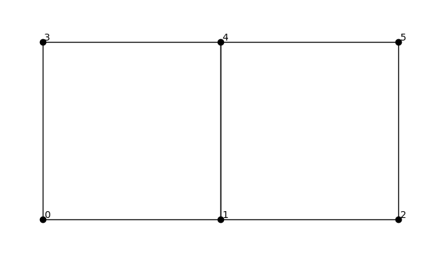
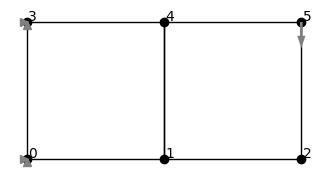

# Getting Started

This section demonstrates the basic workflow of defining, solving, and visualizing a finite element model in *torch-fem*.

Each finite element model in *torch-fem* is defined by three core components: 

-  **Nodes** describe the geometry of the domain. They are given as a tensor in $\mathbb{R}^{N \times d}$ , where $N$ is the total number of nodes and $d$ the dimension in which they live, e.g., $d=2$ for planar structures and $d=3$ for solid structures.

- **Elements** describe the topology of the domain. They are sampled from $\{0, \dots, N-1\}^{M \times m}$, where $M$ is the total number of elements and $m$ the number of nodes per element.

- The **Material** defines the constitutive relation between strain and stress. Material parameters can be provided globally as scalars, or as float `Tensor` with $M$ entries, representing element-wise heterogeneous material fields.


## A minimal cantilever


### Model
Let's consider a very simple example of a coarse planar cantilever beam with six nodes and two elements arranged with unit edge length like this: 
```
3 ---- 4 ---- 5
|      |      |
|      |      |
0 ---- 1 ---- 2
```

In this case, the position of the six nodes can be expressed as

``` py
nodes = torch.tensor([[0., 0.], [1., 0.], [2., 0.], [0., 1.], [1., 1.], [2., 1.]])
```

while the two elements are described as 

``` py
elements = torch.tensor([[0, 1, 4, 3], [1, 2, 5, 4]])
```

!!! info 
    Please note that the nodes in each element are ordered in counter-clockwise direction by convention. Reordering the first element from `[0, 1, 4, 3]` to `[0, 1, 3, 4]` would imply self intersections:
    ```
    3 --- 4 
      \ /    
      / \  
    0 -- 1 
    ```
    If you experience an error *"Negative Jacobian. Check element numbering."* this most likely refers to such a situation.

*torch-fem* comes with many pre-defined material models. In this case, we define a plane stress linear elastic behavior governed by the Young's modulus $E$ and Poisson's ratio $\nu$.

``` py 
from torchfem.materials import IsotropicElasticityPlaneStress

material = IsotropicElasticityPlaneStress(E=1000.0, nu=0.3)
```

Now that we have defined the three main ingredients (**Nodes**, **Elements**, **Material**), we can create a *torch-fem* model. In this case, we create a Planar model, i.e., it operates in a 2D setting with $d=2$:

``` py 
from torchfem import Planar

cantilever = Planar(nodes, elements, material)
```

For each model, we can invoke the `plot()` function for visualization. This 
``` py 
cantilever.plot(node_markers=True, node_labels=True)
```
gives 



### Boundary conditions 

To compute the mechanical deformation of this model, we need to specify boundary conditions. In this case, we specify a force acting in the negative vertical direction at Node 5:

``` py 
# Load at tip [Node_ID, DOF]
cantilever.forces[5, 1] = -1.0
```
and constraints in all directions for Nodes 0 and 3:

``` py 
# Constrained displacement at left end [Node_IDs, DOFs]
cantilever.constraints[[0, 3], :] = True
```

Once again, the `plot()` function helps us visualize the modified model
``` py 
cantilever.plot(node_markers=True, node_labels=True)
```
with triangles indicating constraint directions and arrows indicating forces acting on the nodes.



### Solve 
As soon as the problem is fully defined, we can solve the model with 
```py 
u, f, σ, F, α = cantilever.solve()
```

The solver returns five quantities:

- **Displacement field** `u` $\in \mathbb{R}^{N \times d}$  
  Nodal displacements.

- **Reaction forces** `f` $\in \mathbb{R}^{N \times d}$    
  Internal nodal forces balancing the applied loads.

- **Stress tensor** `σ` $\in \mathbb{R}^{M \times d \times d}$  
  Element-wise stress tensors. 

- **Deformation gradient** `F` $\in \mathbb{R}^{M \times d \times d}$   
  Element-wise deformation gradients.

- **State variables** `α` $\in \mathbb{R}^{M \times \dots}$    
  Internal variables for path-dependent material models (e.g., plasticity, damage).  

We can plot the resulting deformation field with 

```py 
cantilever.plot(u, node_property=torch.norm(u, dim=1))
```
where the first argument `u` visualizes the deformed configuration, while `node_property` is used to color the mesh (here: displacement magnitude).


### Automatic differentiation 

A central feature of *torch-fem* is differentiability. Since the full formulation is implemented in PyTorch, scalar response quantities can be differentiated with respect to model parameters using `torch.autograd`.

As an example, we compute the sensitivity of the compliance with respect to the element thicknesses. First, we enable gradients for the thickness field:

```py
cantilever.thickness.requires_grad = True
```

We then solve the problem again:
```
u, f, _, _, _ = cantilever.solve()
```

The structural compliance is defined as the work of the external forces,
```
compliance = torch.inner(f.ravel(), u.ravel())
```

Finally, the sensitivity with respect to the element thicknesses is obtained via automatic differentiation:
```
sens = torch.autograd.grad(compliance, cantilever.thickness)[0]
```

The result is a vector with two entries containing the sensitivity of compliance w.r.t. to each of those two elements. This mechanism generalizes to material parameters, loads, geometric variables, or any other differentiable model attribute.

### Complete code 

```py
import torch
from torchfem import Planar
from torchfem.materials import IsotropicElasticityPlaneStress

torch.set_default_dtype(torch.float64)

# Nodes and elements
nodes = torch.tensor([[0., 0.], [1., 0.], [2., 0.], [0., 1.], [1., 1.], [2., 1.]])
elements = torch.tensor([[0, 1, 4, 3], [1, 2, 5, 4]])

# Material
material = IsotropicElasticityPlaneStress(E=1000.0, nu=0.3)

# Create model
cantilever = Planar(nodes, elements, material)

# Load at tip [Node_ID, DOF]
cantilever.forces[5, 1] = -1.0

# Constrained displacement at left end [Node_IDs, DOFs]
cantilever.constraints[[0, 3], :] = True

# Solve
u, f, σ, F, α = cantilever.solve()

# Plot displacement magnitude on deformed state
cantilever.plot(u, node_property=torch.norm(u, dim=1))

# Enable automatic differentiation
cantilever.thickness.requires_grad = True
u, f, _, _, _ = cantilever.solve()

# Compute sensitivity of compliance w.r.t. element thicknesses
compliance = torch.inner(f.ravel(), u.ravel())
torch.autograd.grad(compliance, cantilever.thickness)[0]
```
