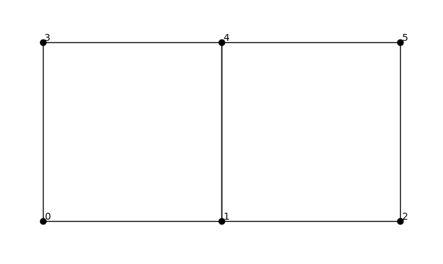
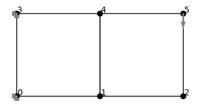
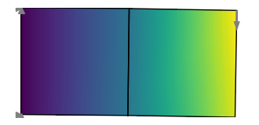
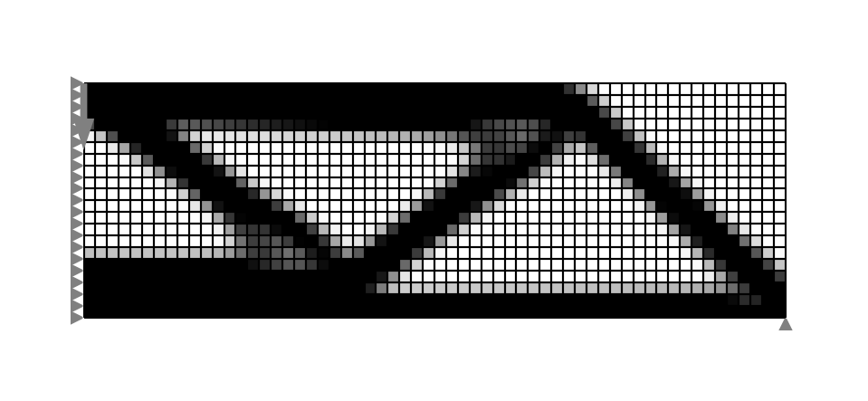

# Getting Started

This section demonstrates the basic workflow of defining, solving, and visualizing a finite element model in *torch-fem*.

Each finite element model in *torch-fem* is defined by three core components: 

-  **Nodes** describe the geometry of the domain. They are given as a tensor in $\mathbb{R}^{N \times d}$ , where $N$ is the total number of nodes and $d$ the dimension in which they live, e.g., $d=2$ for planar structures and $d=3$ for solid structures.

- **Elements** describe the topology of the domain. They are sampled from $\{0, \dots, N-1\}^{M \times m}$, where $M$ is the total number of elements and $m$ the number of nodes per element.

- The **Material** defines the constitutive relation between strain and stress. Material parameters can be provided globally as scalars, or as float `Tensor` with $M$ entries, representing element-wise heterogeneous material fields.


## A minimal cantilever


### Model
Let's consider a very simple example of a coarse planar cantilever beam with six nodes and two elements arranged with unit edge length like this: 
```
3 ---- 4 ---- 5
|      |      |
|      |      |
0 ---- 1 ---- 2
```

In this case, the position of the six nodes can be expressed as

``` py
nodes = torch.tensor([[0., 0.], [1., 0.], [2., 0.], [0., 1.], [1., 1.], [2., 1.]])
```

while the two elements are described as 

``` py
elements = torch.tensor([[0, 1, 4, 3], [1, 2, 5, 4]])
```

!!! info 
    Please note that the nodes in each element are ordered in counter-clockwise direction by convention. Reordering the first element from `[0, 1, 4, 3]` to `[0, 1, 3, 4]` would imply self intersections:
    ```
    3 --- 4 
      \ /    
      / \  
    0 -- 1 
    ```
    If you experience an error *"Negative Jacobian. Check element numbering."* this most likely refers to such a situation.

*torch-fem* comes with many pre-defined material models. In this case, we define a plane stress linear elastic behavior governed by the Young's modulus $E$ and Poisson's ratio $\nu$.

``` py 
from torchfem.materials import IsotropicElasticityPlaneStress

material = IsotropicElasticityPlaneStress(E=1000.0, nu=0.3)
```

Now that we have defined the three main ingredients (**Nodes**, **Elements**, **Material**), we can create a *torch-fem* model. In this case, we create a Planar model, i.e., it operates in a 2D setting with $d=2$:

``` py 
from torchfem import Planar

cantilever = Planar(nodes, elements, material)
```

For each model, we can invoke the `plot()` function for visualization. This 
``` py 
cantilever.plot(node_markers=True, node_labels=True)
```
gives 



### Boundary conditions 

To compute the mechanical deformation of this model, we need to specify boundary conditions. In this case, we specify a force acting in the negative vertical direction at Node 5:

``` py 
# Load at tip [Node_ID, DOF]
cantilever.forces[5, 1] = -1.0
```
and constraints in all directions for Nodes 0 and 3:

``` py 
# Constrained displacement at left end [Node_IDs, DOFs]
cantilever.constraints[[0, 3], :] = True
```

Once again, the `plot()` function helps us visualize the modified model
``` py 
cantilever.plot(node_markers=True, node_labels=True)
```
with triangles indicating constraint directions and arrows indicating forces acting on the nodes.



### Solve 
As soon as the problem is fully defined, we can solve the model with 
```py 
u, f, σ, F, α = cantilever.solve()
```

The solver returns five quantities:

- **Displacement field** `u` $\in \mathbb{R}^{N \times d}$  
  Nodal displacements.

- **Reaction forces** `f` $\in \mathbb{R}^{N \times d}$    
  Internal nodal forces balancing the applied loads.

- **Stress tensor** `σ` $\in \mathbb{R}^{M \times d \times d}$  
  Element-wise stress tensors. 

- **Deformation gradient** `F` $\in \mathbb{R}^{M \times d \times d}$   
  Element-wise deformation gradients.

- **State variables** `α` $\in \mathbb{R}^{M \times \dots}$    
  Internal variables for path-dependent material models (e.g., plasticity, damage).  

We can plot the resulting deformation field with 

```py 
cantilever.plot(u, node_property=torch.norm(u, dim=1))
```
where the first argument `u` visualizes the deformed configuration, while `node_property` is used to color the mesh (here: displacement magnitude).




### Automatic differentiation 

A central feature of *torch-fem* is differentiability. Since the full formulation is implemented in PyTorch, scalar response quantities can be differentiated with respect to model parameters using `torch.autograd`.

For global solves, gradients are computed with implicit adjoint equations at the converged state (instead of backpropagating through all Newton/linear-solver iterations), which keeps memory use manageable in optimization loops.

As an example, we compute the sensitivity of the compliance with respect to the element thicknesses. First, we enable gradients for the thickness field:

```py
cantilever.thickness.requires_grad = True
```

We then solve the problem again and specify the differentiable parameters to tell the solver that we wish to keep an autograd graph for these:
```
u, f, _, _, _ = cantilever.solve(differentiable_parameters=cantilever.thickness)
```

The structural compliance is defined as the work of the external forces,
```
compliance = torch.inner(f.ravel(), u.ravel())
```

Finally, the sensitivity with respect to the element thicknesses is obtained via automatic differentiation:
```
sens = torch.autograd.grad(compliance, cantilever.thickness)[0]
```

The result is a vector with two entries containing the sensitivity of compliance w.r.t. each of those two elements. This mechanism generalizes to material parameters, loads, geometric variables, or any other differentiable model attribute.

[View example on GitHub :fontawesome-brands-github:](https://github.com/meyer-nils/torch-fem/blob/main/examples/basic/planar/minimal.ipynb){ .md-button }
[Open in Google Colab :fontawesome-brands-google-drive:](https://colab.research.google.com/github/meyer-nils/torch-fem/blob/main/examples/basic/planar/minimal.ipynb){ .md-button }

## A minimal topology optimization

Because gradients flow through the solver, structural optimization becomes a compact loop: solve, differentiate a scalar objective, update the design. As an example, we minimize the compliance of the classic half-MBB beam at a fixed material budget - the archetypal SIMP topology optimization.

### Model

We discretize the beam with a structured mesh of $60 \times 20$ quadrilaterals of unit edge length using the `rect_quad` helper from the `torchfem.mesh` subpackage. Exploiting symmetry, we model only the right half: the left edge is a symmetry plane (no horizontal displacement), a roller carries the vertical reaction in the bottom right corner, and a downward load acts in the top left corner:

```py
import torch
from scipy.optimize import bisect

from torchfem import Planar
from torchfem.materials import IsotropicElasticityPlaneStress
from torchfem.mesh import rect_quad

torch.set_default_dtype(torch.float64)

# Domain of 60 x 20 quadrilaterals with unit edge length
Nx, Ny = 60, 20
nodes, elements = rect_quad(Nx + 1, Ny + 1, Nx, Ny)
material = IsotropicElasticityPlaneStress(E=100.0, nu=0.3)
model = Planar(nodes, elements, material)

# Symmetry support (left edge), roller (bottom right), and load (top left)
model.constraints[nodes[:, 0] == 0.0, 0] = True
model.constraints[(nodes[:, 0] == Nx) & (nodes[:, 1] == 0.0), 1] = True
model.forces[(nodes[:, 0] == 0.0) & (nodes[:, 1] == Ny), 1] = -1.0
```

### Design parametrization

Each element gets a design density $\rho_e \in [0.01, 1]$ that scales its thickness through the SIMP penalization $\rho_e^p$ with $p=3$, which makes intermediate densities uneconomical and drives the design towards void ($\rho=0.01$) and solid ($\rho=1$). The elements may use at most half of the domain's area. To avoid checkerboard patterns, the sensitivities are later smoothed with a linear filter $\mathbf{H}$ built from the distances between element centroids:

```py
# SIMP penalization, volume fraction, filter radius, and move limit
p, vol_frac, filter_radius, move = 3.0, 0.5, 1.5, 0.2

# Element areas and target volume
areas = model.integrate_field()
V_0 = vol_frac * areas.sum()

# Linear sensitivity filter weights between element centroids
centroids = nodes[elements].mean(dim=1)
H = torch.clamp(filter_radius - torch.cdist(centroids, centroids), min=0.0)

# Design variables (element densities)
rho = vol_frac * torch.ones(model.n_elem)
```

### Optimization loop

In each iteration, we assign the penalized densities to the element thicknesses, solve, and evaluate the compliance $C = \mathbf{f} \cdot \mathbf{u}$. Its sensitivity $\partial C / \partial \boldsymbol{\rho}$ is a single autograd call - no need to derive the analytical SIMP gradient by hand. The sensitivities are smoothed with the filter, and the densities are then updated with the optimality-criteria scheme, where a bisection on the Lagrange multiplier $\mu$ enforces the volume constraint:

```py
for _ in range(100):
    # Solve with SIMP-penalized densities as element thickness
    rho = rho.requires_grad_()
    model.thickness = rho**p
    u, f, _, _, _ = model.solve(differentiable_parameters=rho)

    # Compliance and its sensitivity via automatic differentiation
    compliance = torch.inner(f.ravel(), u.ravel())
    dc = torch.autograd.grad(compliance, rho)[0]

    # Smooth the sensitivities with the linear filter
    dc = H @ (rho * dc) / H.sum(dim=0) / rho

    # Optimality-criteria update with a bisected Lagrange multiplier
    with torch.no_grad():
        lower = torch.clamp((1 - move) * rho, min=0.01)
        upper = torch.clamp((1 + move) * rho, max=1.0)

        def oc(mu):
            return torch.clamp(rho * torch.sqrt(-dc / mu), lower, upper)

        mu = bisect(lambda mu: torch.dot(areas, oc(mu)) - V_0, 1e-10, 1e2)
        rho = oc(mu)
```

### Result

The 100 iterations take a couple of seconds on a laptop CPU. The compliance drops from about 10.1 to 2.0, i.e., the structure is roughly five times stiffer than the uniform design with the same amount of material, and we can plot the material distribution:

```py
model.plot(element_property=rho, cmap="gray_r")
```



Since the FE solve is differentiable, this autograd sensitivity matches the classic analytical SIMP gradient $-p\,\rho_e^{p-1}\,\mathbf{u}_e \cdot \mathbf{k}_{0,e} \cdot \mathbf{u}_e$ down to machine precision. Automatic differentiation only trades a little speed for the convenience of not deriving it by hand:

| Sensitivities | Final compliance | Speed |
| --- | :---: | :---: |
| Analytical | 2.0453 | ~52 it/s |
| Automatic differentiation | 2.0453 | ~33 it/s |

(Measured on a laptop CPU for this $60 \times 20$ mesh; the two final designs differ by less than $10^{-10}$.)

More elaborate variants of this loop - 3D solids, thermal problems, combined topology and orientation optimization, shape optimization with MMA - are collected in the [examples](examples.md).

[View example on GitHub :fontawesome-brands-github:](https://github.com/meyer-nils/torch-fem/blob/main/examples/optimization/planar/topology.ipynb){ .md-button }
[Open in Google Colab :fontawesome-brands-google-drive:](https://colab.research.google.com/github/meyer-nils/torch-fem/blob/main/examples/optimization/planar/topology.ipynb){ .md-button }