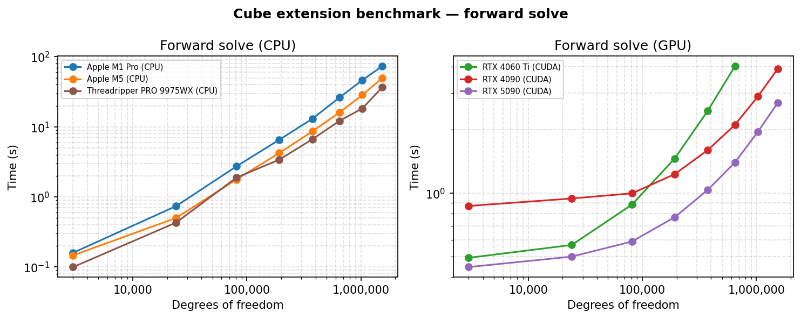
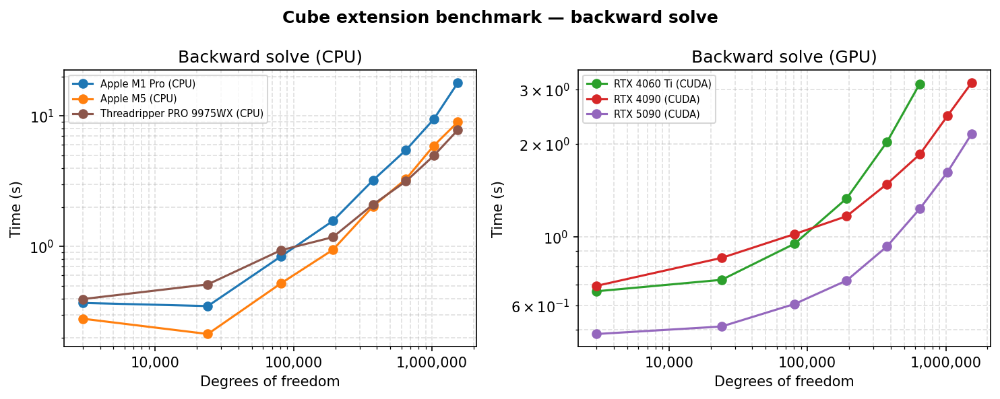
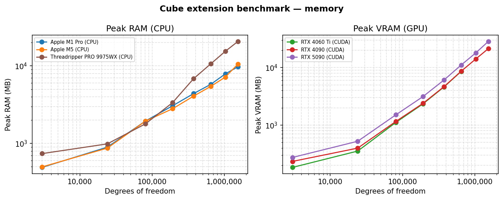
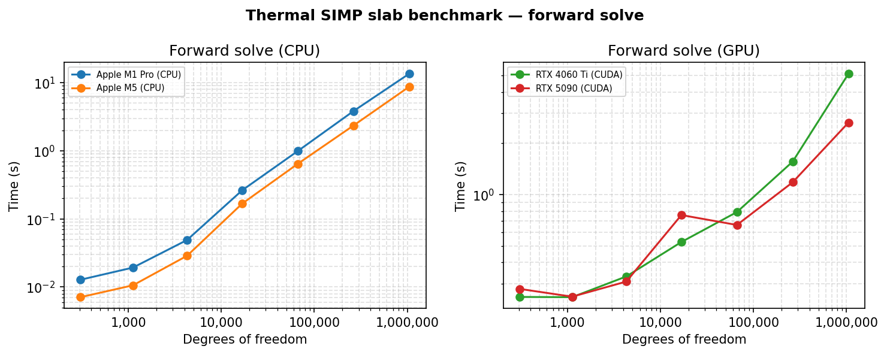
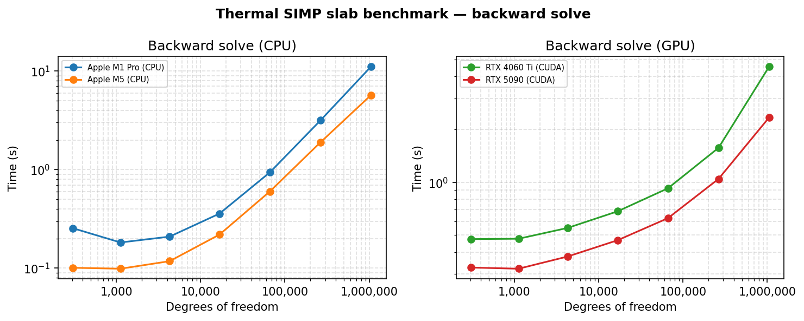
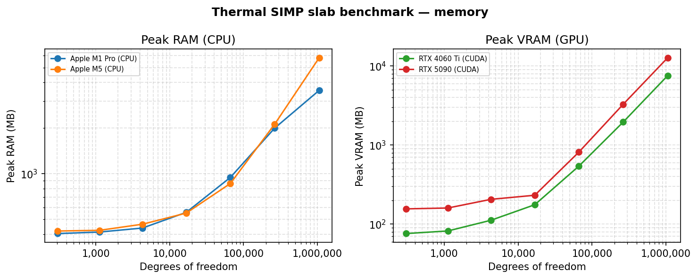
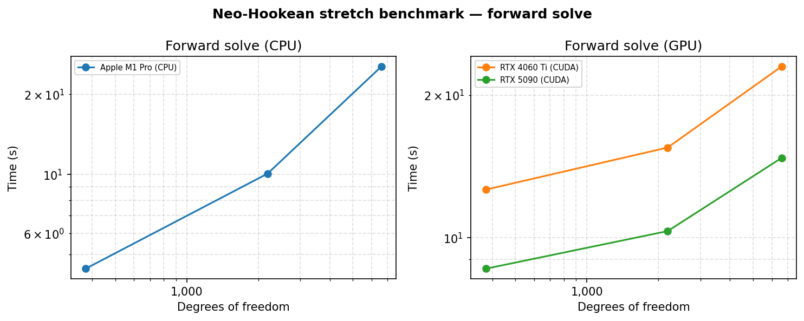
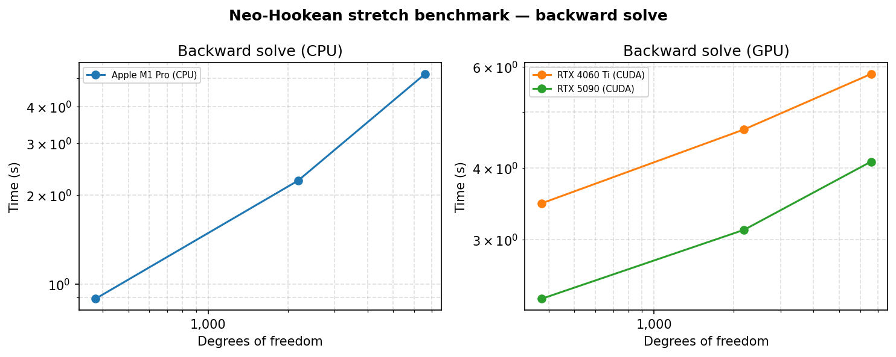
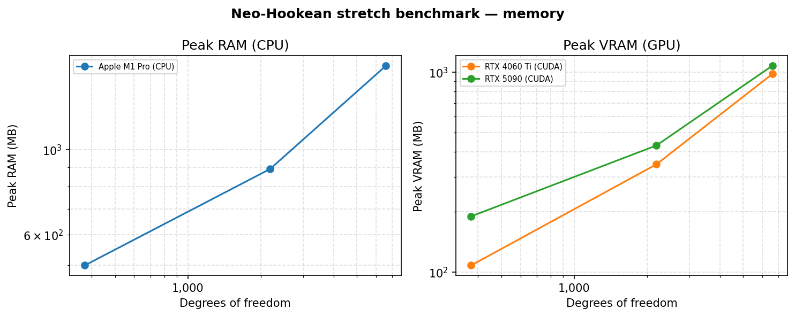

# Performance

This page documents the scaling behavior of *torch-fem* on canonical benchmark problems and shows how to reproduce the results on your own hardware. All benchmarks measure the same three phases per run:

- **Setup** — mostly computing the sparsity pattern.
- **Forward solve** — assembly and sparse linear system solve.
- **Backward solve** — reverse-mode AD through the solve via `autograd`.

Peak RAM is tracked by polling the child-process RSS every 50 ms; peak VRAM is sampled at the driver level.

## Structural benchmark: cube extension

A unit cube is subjected to one-dimensional extension:

- Discretised with $N \times N \times N$ linear hexahedral (Hexa1) elements ($3N^3$ degrees of freedom).
- Material: isotropic linear elasticity, $E = 1000$, $\nu = 0.3$.
- Boundary conditions: fully clamped at $x = 0$; prescribed displacement $u_x = 0.1$ at $x = 1$.
- Backward pass: gradient of `u.sum()` w.r.t. nodal forces.







## Thermal benchmark: SIMP heated slab

A quasi-2D heated slab with SIMP-penalized conductivity, mirroring the *thermal-mesh* problem of the [mosaic benchmark suite](https://github.com/pasteurlabs/mosaic), which compares differentiable solvers (including *torch-fem*) across frameworks:

- Domain $[0,2] \times [0,1] \times [0,1]$, discretised with a single layer of $N \times N/2 \times 1$ linear hexahedral (Hexa1) elements — one temperature degree of freedom per node.
- Material: isotropic conductivity with SIMP penalization $k(\rho) = k_\min + (k_\max - k_\min)\,\rho^3$, $k_\min = 10^{-3} k_\max$, at uniform density $\rho = 0.5$.
- Boundary conditions: $T = 0$ at $x = 0$; uniform heat flux $Q = 1$ on the face at $x = 2$.
- Backward pass: gradient of the thermal compliance $C = \oint_{\Gamma_N} q_n T \, d\Gamma$ w.r.t. the per-element densities $\rho$ — the adjoint sensitivity used in topology optimization.







## Hyperelastic benchmark: Neo-Hookean large stretch

A unit cube is stretched to twenty times its original length, mirroring the [large stretch example](https://github.com/meyer-nils/torch-fem/blob/main/examples/basic/solid/large_stretch.ipynb):

- Discretised with $(N-1) \times (N-1) \times (N-1)$ linear hexahedral (Hexa1) elements ($3N^3$ degrees of freedom, $N$ odd).
- Material: Neo-Hookean strain energy $\psi(\mathbf{C}) = \frac{\mu}{2}(\textrm{tr}(\mathbf{C}) - 3) - \mu \ln J + \frac{\lambda}{2} (\ln J)^2$ with $E = 1000$, $\nu = 0.3$.
- Boundary conditions: $u_x = 0$ at $x = 0$; prescribed displacement $u_x = 19$ at $x = 1$ (stretch $\lambda = 20$); symmetry constraints on the center planes.
- Load applied in 21 increments that are geometric in the stretch, with full Newton iterations (`nlgeom=True`) per increment.
- Backward pass: gradient of the total reaction force w.r.t. the Lamé parameters $(\mu, \lambda)$ — the adjoint used in material parameter calibration.

The forward solution matches the analytical uniaxial Neo-Hookean response.







## Reproducing the results

The scripts live in `benchmarks/` at the repository root.

**1. Run the benchmark**:

```bash
# All benchmarks on CPU (default)
python benchmarks/run.py

# Structural benchmark on CUDA
python benchmarks/run.py -problem cube -device cuda --label rtx5090_cuda --hardware "RTX 5090"

# Thermal benchmark
python benchmarks/run.py -problem thermal --label m1_pro_cpu --hardware "Apple M1 Pro"

```

The label identifies the machine; results are written to `benchmarks/results/<problem>_<label>.json`.

**2. Regenerate the plots**:

```bash
python benchmarks/plot.py
```

This reads all JSON files in `benchmarks/results/`, groups them by problem, and writes the timing, backward, and RAM plots to `docs/images/benchmark_*.png` (structural) and `docs/images/benchmark_thermal_*.png` (thermal).

